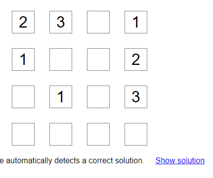
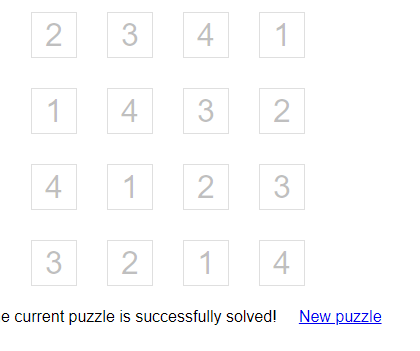

# futoshiki
    O mesmo número não pode ser repetido na mesma COLUNA/LINHA

## RESTRIÇÕES
    Algumas células podem ter restrições como: ">","<" elas definem que o numero ao lado tem que ser maior 
    ou menor que numero adjacente ao símbolo
    AS RETRIÇÔES DA DIREITA VAO PARA CELULA DA ESQUERDA, AS ABAIXO VAO PARA CIMA
    CADA CELULA DO TABULEIRO É UM OBJETO QUE CONTEM UM NUMERO E ARRAY DE RESTRIÇÔES: 1>^V

